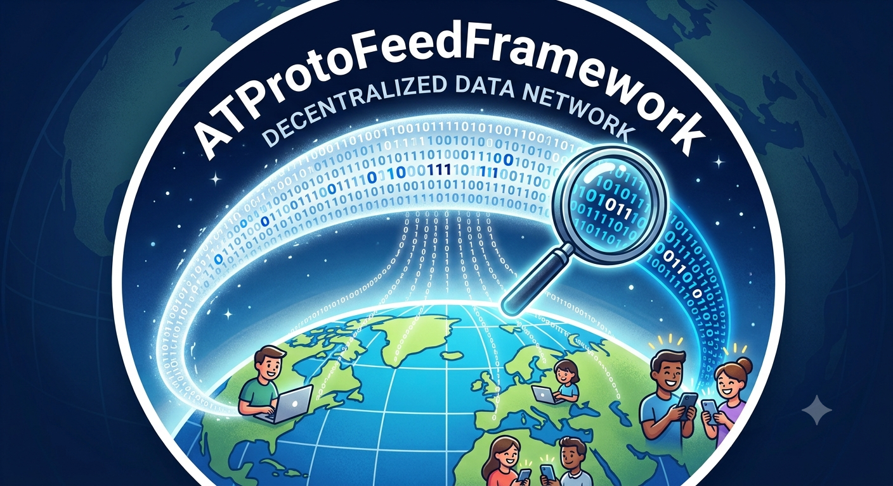

# ATProtoFeedFramework

> **Build feed logic, not feed infrastructure.**

ATProtoFeedFramework is an open-source Java framework that enables developers to build and operate custom ATProto feeds without implementing the underlying protocol infrastructure themselves.

Instead of dealing with event ingestion, indexing, persistence and the ATProto Feed Generator API, developers can focus entirely on the business logic that makes their feed unique.

## Architecture

ATProtoFeedFramework is a **multi-module Maven project** designed as a reusable framework:

```
ATProtoFeedFramework/
├── atproto-feed-api/          # Pure Java contracts
├── atproto-feed-framework/    # Spring Boot implementation
└── sample-feed-server/         # Reference implementation
```

### Modules

#### atproto-feed-api

Contains **stable public contracts** with zero Spring dependencies:

- `FeedProvider` - Core interface for feed implementations
- `FeedIndex` - Feed storage and querying
- `EventSource` - Event stream subscription
- Domain models and DTOs

**Maven Coordinates:**
```xml
<dependency>
    <groupId>de.bluewhale</groupId>
    <artifactId>atproto-feed-api</artifactId>
    <version>0.2.0-SNAPSHOT</version>
</dependency>
```

#### atproto-feed-framework

Contains the **reusable Spring Boot implementation**:

- Jetstream client and connection management
- JPA-based feed indexing
- Spring Boot auto-configuration
- Health indicators and metrics
- Default implementations

**Maven Coordinates:**
```xml
<dependency>
    <groupId>de.bluewhale</groupId>
    <artifactId>atproto-feed-framework</artifactId>
    <version>0.2.0-SNAPSHOT</version>
</dependency>
```

#### sample-feed-server

A **complete working example** demonstrating framework usage. See [sample-feed-server/README.md](sample-feed-server/README.md) for details.



Frameworks are always abstract, how to find a suitable self-explaining logo? I finally came up with this one and Gemini helped
to scheme my vision. The result, though beautiful is not self-explaining, so here some words a about the symbols:
You see user around the world publishing a lot of social content on Bluesky using the underlying ATProto.
Alltogether they are building a jet-stream in our atmosphere consisting of digital information. 
The ATProtoFeedFramework allows to build up applications (like the lens), that focus on specific parts of information
within the stream, thus building a specific kind of feed stream which in turn can be consumed by happy participants
on the social network. 

What do you think? Suitable for this project? Anyway I really like the illustration 🚀.

---

## Developer Journey


Creating a custom feed should be straightforward:

1. Add **ATProtoFeedFramework** to your project.
2. Implement one or more feed rules.
3. Configure the application.
4. Start the application.
5. Publish your feed.
6. Share it with the community.

The framework takes care of the protocol infrastructure so you can focus on your feed logic.

---

## Quick Start

### 1. Add Framework Dependency

```xml
<dependency>
    <groupId>de.bluewhale</groupId>
    <artifactId>atproto-feed-framework</artifactId>
    <version>0.2.0-SNAPSHOT</version>
</dependency>
```

### 2. Implement FeedProvider

```java
@Component
public class MyFeedProvider implements FeedProvider {
    
    @Override
    public String getFeedId() {
        return "at://did:plc:example/app.bsky.feed.generator/my-feed";
    }
    
    @Override
    public boolean shouldIndex(PostReference post) {
        // Your filtering logic
        return true;
    }
    
    @Override
    public List<PostReference> selectPosts(FeedContext context) {
        // Your ranking logic
        return context.candidatePosts();
    }
}
```

### 3. Configure Application

```yaml
atproto:
  feed:
    jetstream-url: wss://jetstream2.us-west.bsky.network/subscribe
    feed-id: at://did:plc:example/app.bsky.feed.generator/my-feed

spring:
  datasource:
    url: jdbc:mariadb://localhost:3306/atproto_feed
    username: feed_user
    password: your_password
```

### 4. Run

```bash
mvn spring-boot:run
```

The framework automatically:
- Connects to Jetstream
- Subscribes to repository events
- Indexes posts matching your criteria
- Exposes the Feed Generator API

---

## Building from Source

### Prerequisites

- Java 25+
- Maven 3.9+
- MariaDB 10.6+

### Build All Modules

```bash
mvn clean verify
```

### Build Individual Modules

```bash
# API only
mvn clean install -pl atproto-feed-api

# Framework only
mvn clean install -pl atproto-feed-framework

# Sample application
mvn clean package -pl sample-feed-server
```

### Run Sample Application

```bash
cd sample-feed-server
mvn spring-boot:run
```

Or run the executable JAR:

```bash
java -jar sample-feed-server/target/sample-feed-server.jar
```

---

## About ATProto

ATProto is the open protocol powering Bluesky and related decentralized social networking services.

Among its extensibility mechanisms, ATProto allows developers to provide custom feeds through the standardized **Feed Generator API**.

Although the specification refers to this component as a *Feed Generator*, it does not generate content. Instead, it selects and ranks existing posts and exposes references to them through a standardized API.

ATProtoFeedFramework provides a Java-based foundation for building and operating these Feed Applications.

---

## Why does this project exist?

The ATProto ecosystem provides a powerful protocol for creating custom feeds. Existing implementations are predominantly based on JavaScript and TypeScript, which are an excellent fit for many use cases.

However, many developers and organizations already operate mature Java ecosystems with established build pipelines, operational practices and long-term maintenance strategies. Rebuilding the same infrastructure in a different technology stack introduces unnecessary operational complexity.

ATProtoFeedFramework provides a familiar, production-oriented Java foundation for building and operating ATProto Feed Applications.

Instead of repeatedly solving infrastructure concerns such as event ingestion, indexing, persistence, configuration, monitoring and deployment, developers can focus on the one aspect that makes every feed unique:

> **its selection and ranking logic.**

---

## Goals

ATProtoFeedFramework pursues a small number of clearly defined goals:

- Provide reusable infrastructure for ATProto Feed Applications.
- Reduce boilerplate code.
- Let developers focus on feed logic instead of protocol details.
- Integrate naturally into modern Java development environments.
- Support production deployments.
- Keep operational complexity as low as reasonably possible.

---

## Non Goals

ATProtoFeedFramework intentionally does **not** aim to become:

- a Personal Data Server (PDS)
- an AppView implementation
- a search engine
- a content archive
- a replacement for the ATProto protocol
- a complete social networking platform

---

## Project Status

The framework has completed **multi-module refactoring** (v0.2.0-SNAPSHOT):

✅ API layer separated into pure Java contracts  
✅ Framework implementation available as Maven dependency  
✅ Sample application demonstrating usage patterns  
✅ Spring Boot auto-configuration enabled  

**Next Steps:**
- Implement JetstreamEventSource (WebSocket connection)
- Implement MariaDBFeedIndex (persistence)
- Add Feed Generator API REST endpoints
- Metrics and monitoring integration

---

## Documentation

The project documentation follows the **arc42** architecture documentation standard.

Available documentation includes:

- Project vision and goals
- Architecture documentation
- Architectural Decision Records (ADRs)
- Project glossary

See the [`docs`](docs) directory for details.

---

## Sample Application

A complete reference implementation is available in the [`sample-feed-server`](sample-feed-server) module.

It demonstrates:
- Spring Boot application setup
- Custom FeedProvider implementation
- Configuration patterns
- Best practices

See [sample-feed-server/README.md](sample-feed-server/README.md) for details.

---

## Migration Guide

If you are upgrading from a pre-0.2.0 version, see [MIGRATION.md](MIGRATION.md) for breaking changes and upgrade instructions.

---

## Contributing

The project is currently under active development.

Contributions, discussions and constructive feedback are welcome once the initial architecture has been established.

---

## License

The project is under the Apache License 2.0. See the [`LICENSE`](LICENSE) file for details.