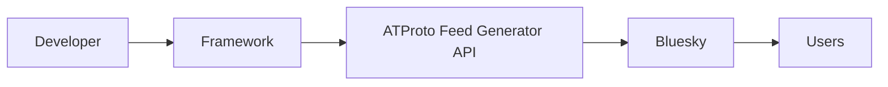
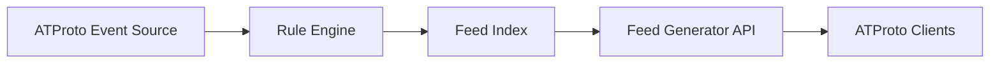

# 03 Context and Scope

## Business Context

* The developer implements feed logic using ATProtoFeedFramework.
* The framework exposes the standardized ATProto Feed Generator API.
* Bluesky (or any compatible ATProto client) consumes the generated feed.
* End users browse the resulting feed using their preferred client.

## Technical Context

The framework continuously consumes ATProto events from an external event source. Incoming events are evaluated by one or more feed rules. Matching posts are indexed and later exposed through the standardized Feed Generator API.

The framework stores references to posts rather than post contents.