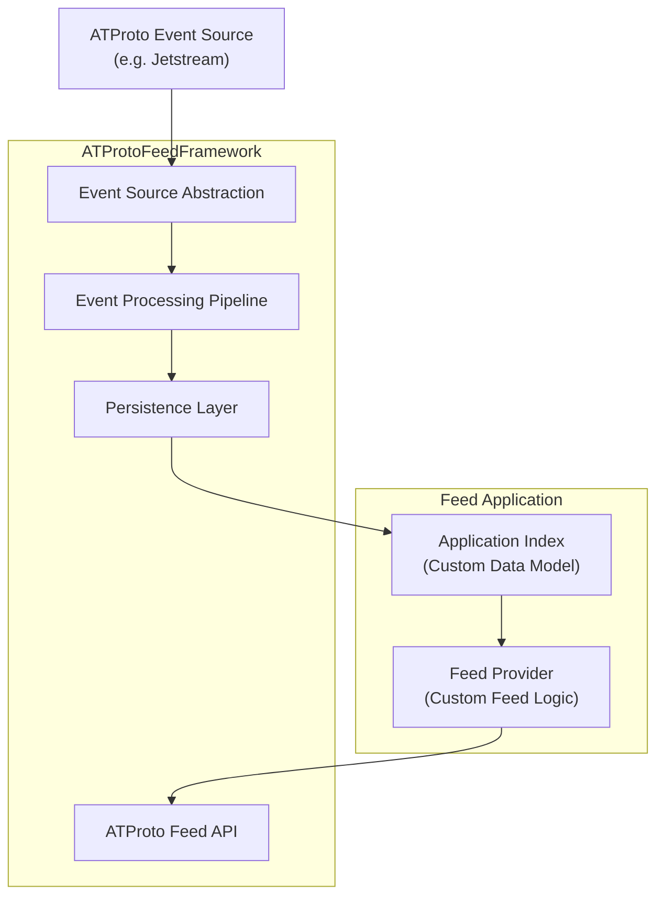

# 5. Building Block View

## 5.1 Level 1: Whitebox View — ATProtoFeedFramework

The ATProtoFeedFramework provides the technical foundation for building custom ATProto feed applications.

The framework itself does not define the business logic of a feed. Instead, it provides reusable components for connecting to ATProto event sources, processing repository events, maintaining an application-specific index, and exposing a feed endpoint.

The following diagram shows the major building blocks:



The main responsibility separation is:

| Component | Responsibility |
|---|---|
| Feed Application | Defines why and how posts are selected for a specific feed |
| Event Source Abstraction | Provides access to ATProto repository events |
| Event Processing Pipeline | Converts incoming repository events into framework-internal events |
| Persistence Layer | Stores processed data required for feed generation |
| Feed Provider | Implements the feed selection algorithm |
| ATProto Feed API | Exposes the generated feed according to ATProto requirements |

---

# 5.2 Level 2: Whitebox View — Framework Components

The framework consists of several replaceable components.

## Event Source Abstraction

The Event Source abstraction hides the details of the underlying ATProto event stream.

The first implementation target is expected to be an adapter for ATProto Jetstream.

The framework should not require feed developers to directly handle:

- WebSocket connections
- Event deserialization
- Repository event filtering
- Connection lifecycle management

Conceptual interface:

```java
public interface EventSource {

    void connect();

    void subscribe(EventHandler handler);

    void disconnect();
}
```

Possible implementations:

```text
EventSource
    |
    +-- JetstreamEventSource
    |
    +-- FirehoseEventSource
    |
    +-- TestEventSource
```

This allows the framework to evolve independently from a specific ATProto event delivery mechanism.

---

## Event Processing Pipeline

The event processing pipeline transforms incoming ATProto events into a normalized internal representation.

Responsibilities:

- Validate incoming events
- Filter irrelevant events
- Convert ATProto records into framework objects
- Forward relevant changes to persistence components

The pipeline is intentionally independent from feed-specific logic.

Example:

```text
ATProto Event
      |
      v
Event Processor
      |
      v
Normalized Event
      |
      v
Application Index
```

---

## Persistence Layer

The persistence layer stores data required for feed generation.

The framework does not prescribe a specific database technology.

Possible implementations:

- relational databases
- embedded databases
- distributed storage solutions

The initial reference implementation uses MariaDB.

The persistence layer is responsible for:

- storing indexed posts
- maintaining processing state
- supporting efficient feed queries

---

## Feed Provider

The Feed Provider represents the application-specific part of an ATProto feed.

A feed implementation provides the selection logic.

Example:

```java
public interface FeedProvider {

    List<Post> selectPosts(FeedContext context);

}
```

A Feed Provider may implement:

- geographic feeds
- topic-based feeds
- recommendation feeds
- community feeds
- chronological feeds

The framework only provides the infrastructure required to execute and publish the feed.

---

## ATProto Feed API

The ATProto Feed API exposes the generated feed to external ATProto clients.

Responsibilities:

- Handle feed requests
- Apply pagination
- Convert internal objects into ATProto feed responses
- Provide the public feed endpoint

Feed clients do not communicate directly with the Event Source or persistence layer.

---

# 5.3 Level 3: Application Example — SampleAppImpl

The repository will provide a minimal reference implementation demonstrating how developers create their own feed.

The sample application intentionally contains only application-specific logic.

Example structure:

```text
SampleAppImpl

    +-- configuration
    |
    +-- FeedProvider implementation
    |
    +-- domain model
    |
    +-- optional persistence extensions
```

The developer workflow should be:

1. Add the ATProtoFeedFramework dependency
2. Configure the event source
3. Implement a FeedProvider
4. Start the application
5. Publish the feed endpoint

The sample application should demonstrate that a feed developer does not need to implement:

- ATProto protocol handling
- Event stream management
- Repository synchronization
- Feed API handling

These capabilities are provided by the framework.

---

# 5.4 Architectural Principles

The building block design follows these principles:

## Separation of infrastructure and feed logic

The framework manages technical complexity.
The application defines the feed behavior.

## Replaceable components

External dependencies such as event sources and persistence technologies should be replaceable through abstractions.

## Extension over modification

New feed types should be implemented through extensions and plugins rather than changes to the framework core.

## Protocol independence

The framework should avoid coupling application logic directly to a specific ATProto transport implementation.

---

# 5.5 Future Extensions

Potential future building blocks:

- Additional ATProto event source adapters
- Plugin system for feed algorithms
- Shared indexing services
- Distributed feed processing
- Administrative monitoring interfaces
- Metrics and operational dashboards